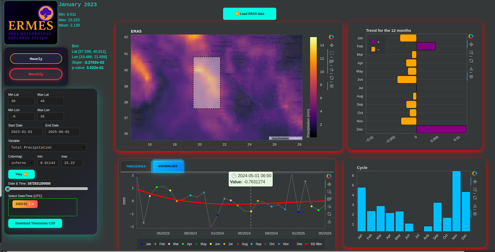
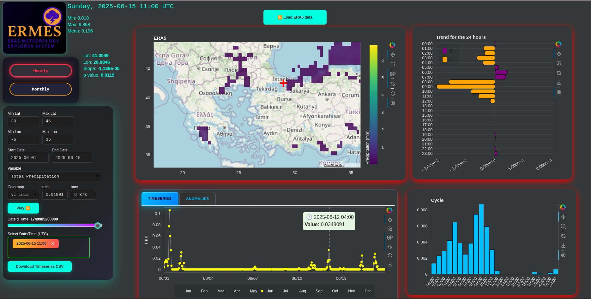
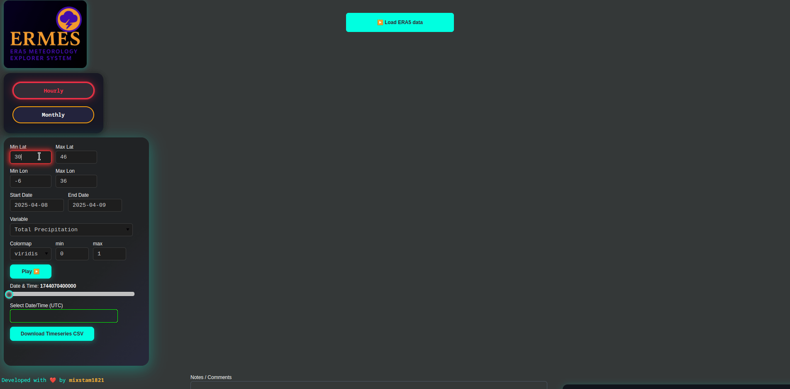
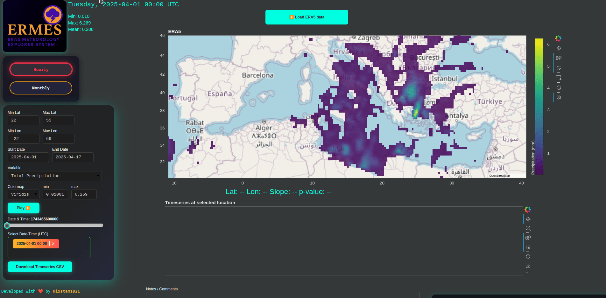
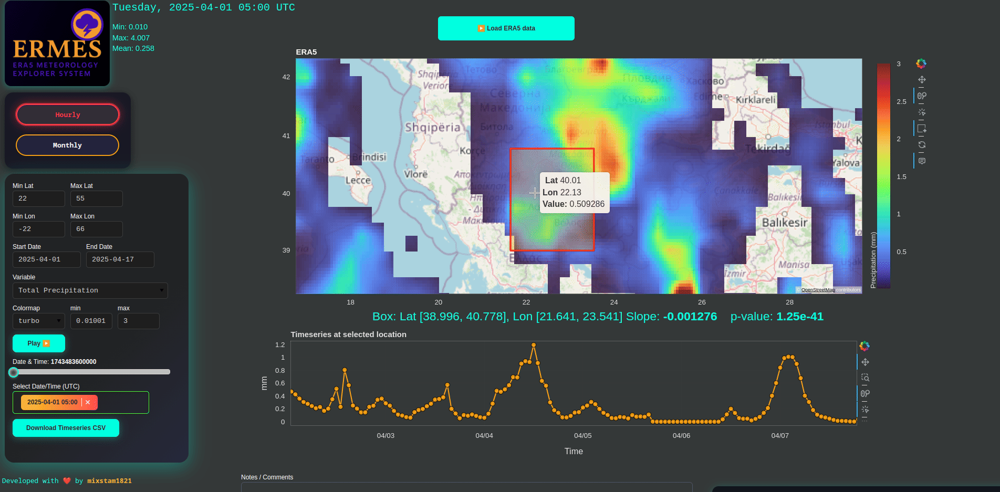
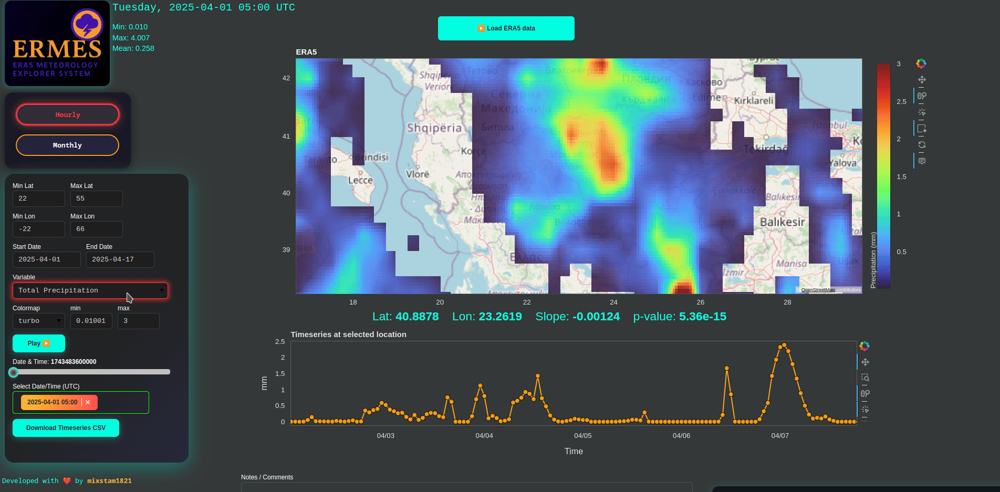
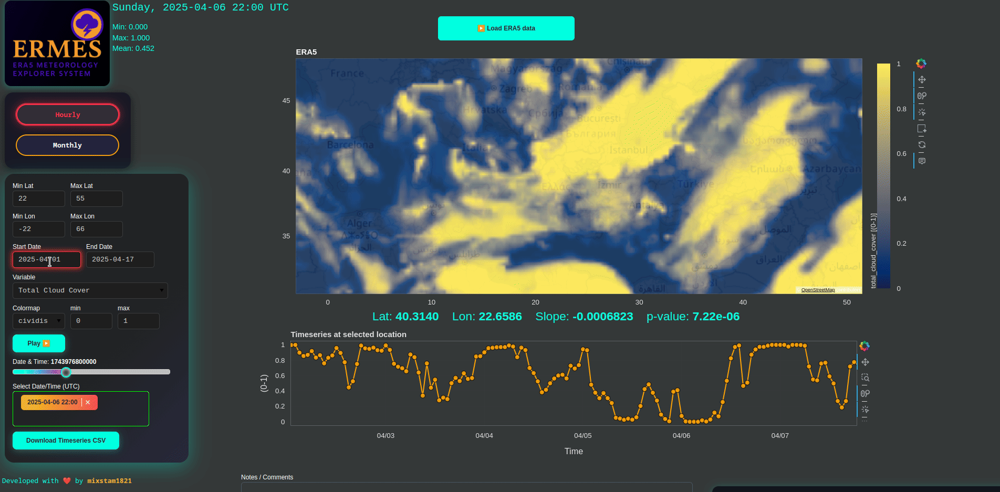

# ERMES
ERA5 METEOROLOGY EXPLORER SYSTEM

ERMES is an advanced interactive explorer for ERA5 reanalysis data, built in Python with Bokeh. Effortlessly load, visualize, and analyze atmospheric and oceanic variables with high precision for both recent decades and historical weather events.

> **Note:** ERA5 monthly means are available only up to the last fully completed month, while hourly data is accessible with a delay of a few days. Requests for the current (incomplete) month or current day will result in an error from the CDS. Such errors will be shown on the bottom right frame.


---

## UPDATE 02.07.2025:
- Monthly mode by default (emphasis for climatological data)
- Annual and Hourly cycle added!
- Trends for the 12 months of the year or the 24 hours of the day added!
- When you click on map, a red cross appear to track the click point.
- Timeseries for the deseasonalized anomalies for monthly data are available with low pass filtered (Savitzky-Golay filter) data.
- Easier rectangular selection by selecting the rectangle in the toolbar and dragging with mouse click in the region you want. With a double click on the rect, it will be removed.





## How to use it?

- Quick Start:
Set the latitude and longitude range for your area of interest and adjust the date range as needed. Then, press the top button to load the data.

Note: Live data is not currently supported—please use the tool to explore historical weather or climate data. The default mode is hourly, so it’s recommended to start with that.
  
  
- After about a minute, the data will be loaded from the ERA5 database. The map displays data for a single date, which you can change using the slider or dropdown menu.
Click on any location (lat/lon) on the map to view the timeseries of the selected variable at that point. You can also click on points within the timeseries plot to update the map to that specific date. Use the play button to animate the map over time.
  
  
- You can change the colormap and adjust its minimum and maximum values. Interact with the map using wheel zoom and click events.
To get a spatially averaged timeseries, select the box tool from the toolbox, then hold Shift and click-drag to draw your region of interest. Release the mouse first, then release Shift.
To remove the red selection box, simply click on it and press Backspace.
Use the "Download Timeseries CSV" button to download the currently displayed timeseries.
  
  
  
- Changing the variable will automatically start loading the new data.
  
  

- If you want to go monthly, firstly set the new date range (eg, April 2020 to May 2025) and then press the monthly button.
  

  
- After the monthly data loading, you can explore it or change the variable.
  


## 🌍 What is This?

This project lets you **fetch, plot, and analyze ERA5 climate data** for any world region, using a fast, responsive web interface (Bokeh server).  
**Features:**
- Hourly and Monthly ERA5 data fetch via Copernicus CDS
- Custom region and date range selection
- Beautiful, interactive map with colormap, slider, and real-time stats
- Click anywhere to get a timeseries at that location
- Fully styled, modern dark UI (custom CSS)
- Supports precipitation, temperature, winds, and more
- One-click data reload, animation (play/pause), and info overlays

---

## 🏁 Quick Start

1. **Install requirements:**
    ```bash
    pip install -r requirements.txt
    ```

2. **Set your Copernicus CDS API key**  
   Edit `ERMES.py` or your `.cdsapirc` file with your own [CDS API credentials](https://cds.climate.copernicus.eu/). Currently, my key is used.

3. **Run the app:**
    ```bash
    bokeh serve --show ERMES.py
    ```
OR

```
git clone https://github.com/mixstam1821/ERMES.git
cd ERMES
docker build -t ermes-app .
docker run -p 9263:9263 ermes-app
```
You will see a message: `Bokeh app running at: http://localhost:9263/ERMES`. Open `http://localhost:9263/ERMES` and enjoy.

OR

Visit the online [app](https://py.cafe/app/mixstam1821/ERMES%3A%20ERA5%20Meteorology%20Explorer%20System).

---

## ⚙️ Features & How To Use

- **Select Region:** Enter min/max latitude and longitude for your area.
- **Select Dates:** Use date pickers for start/end.
- **Variable:** Choose from 15+ ERA5 variables (wind, temp, precip, etc).
- **Colormap:** Try Viridis, Inferno, Plasma, Cividis, or Magma.
- **Slider:** Scroll through time; click "Play" for animation.
- **Map:** Tap any location to get a timeseries chart instantly.
- **Color scaling:** Adjust min/max for advanced contrast.
- **Custom Notes:** Add your own notes or comments in-app.

---

## 📦 Requirements

- Python 3.8+
- [Bokeh](https://bokeh.org/)
- `numpy`, `pandas`, `xarray`, `cdsapi`, `scipy`, `pyproj`
- See `requirements.txt` for all dependencies.

---

## 🛰️ Data Source

- **ERA5 Reanalysis** from [Copernicus Climate Data Store (CDS)](https://cds.climate.copernicus.eu/cdsapp#!/dataset/reanalysis-era5-single-levels)
- Supported for both **hourly** and **monthly** single-level fields.

---

## 🖼️ UI & Visualization

- **Map:** OpenStreetMap tiles, Web Mercator projection
- **Image:** High-res heatmap, auto-resampled for region
- **Stats:** Min/Max/Mean, real-time for the selected field
- **Interactive:** Responsive sliders, dropdowns, radio buttons, play/pause, multi-choice date select
- **CSS:** Sleek, modern dark theme with custom styling for all widgets

---

## 🛠️ Code Structure

```txt
ERMES.py
│
├── Imports, Theme, Variable Mappings
├── Widget/Style Definitions (lots of custom CSS)
├── ERA5 Fetcher (`fetch_era5`)
├── Projection and Interpolation Logic
├── Bokeh Plot Setups (Map, Timeseries, Controls)
├── Callbacks (Slider, Tap, Variable Change, etc)
└── App Layout & Main Loop
 ```
```
ERA5 Variables Supported in ERMES

10m_u_component_of_wind – 10m U Wind

10m_v_component_of_wind – 10m V Wind

2m_dewpoint_temperature – 2m Dewpoint Temperature

2m_temperature – 2m Temperature

mean_sea_level_pressure – Mean Sea Level Pressure

mean_wave_direction – Mean Wave Direction

sea_surface_temperature – Sea Surface Temperature

surface_pressure – Surface Pressure

total_precipitation – Total Precipitation

surface_net_solar_radiation – Surface Net Solar Radiation

surface_solar_radiation_downwards – Surface Solar Radiation Downwards

total_cloud_cover – Total Cloud Cover

evaporation – Evaporation

snowfall – Snowfall

k_index – K Index

sea_ice_cover – Sea Ice Cover

high_cloud_cover – High Cloud Cover

medium_cloud_cover – Medium Cloud Cover

low_cloud_cover – Low Cloud Cover

lake_cover – Lake Cover

lake_depth – Lake Depth

snow_depth – Snow Depth

snowmelt – Snowmelt

soil_temperature_level_1 – Soil Temperature Level 1

soil_temperature_level_2 – Soil Temperature Level 2

maximum_individual_wave_height – Maximum Individual Wave Height

mean_period_of_total_swell – Mean Period of Total Swell

total_column_ozone – Total Column Ozone

total_column_water_vapour – Total Column Water Vapour

total_totals_index – Total Totals Index
```

## Feedback
Feedback is welcome!
Please share your suggestions or issues to help me make this project even better.
