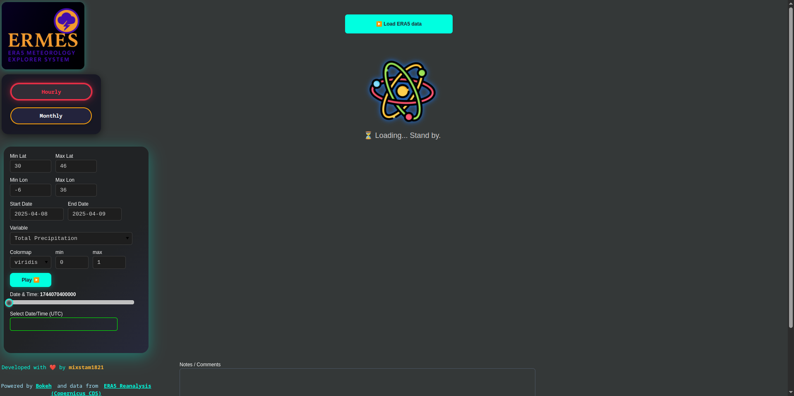
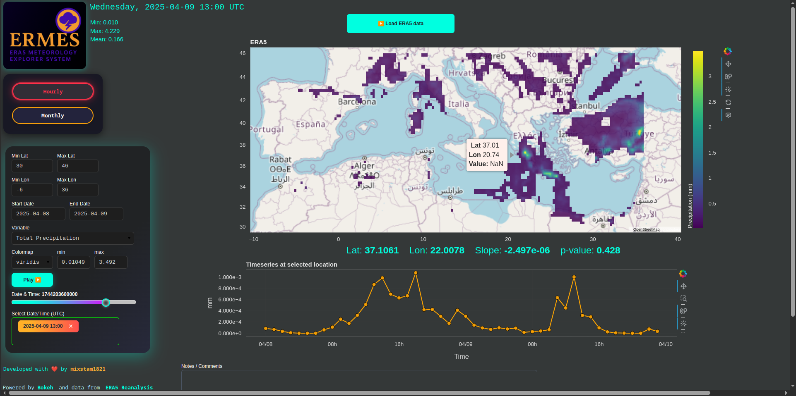
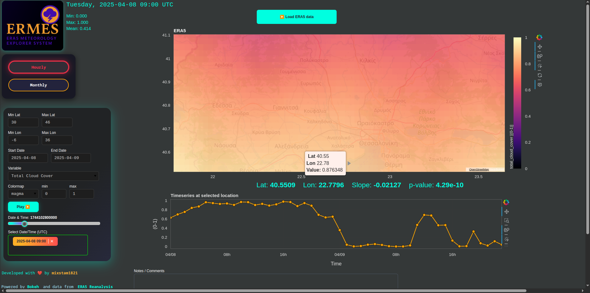

# ERMES
ERA5 METEOROLOGY EXPLORER SYSTEM

**Advanced interactive explorer for ERA5 reanalysis data, built in Python with Bokeh.**  
Visualize, analyze, and download atmospheric and oceanic variables in stunning detail.

---

## Screenshots






## Demo

[](ERMES.mp4)


## 🌍 What is This?

This project lets you **fetch, plot, and analyze ERA5 climate data** for any Mediterranean subdomain, using a fast, responsive web interface (Bokeh server).  
**Features:**
- Hourly and Monthly ERA5 data fetch via Copernicus CDS
- Custom region and date range selection
- Beautiful, interactive map with colormap, slider, and real-time stats
- Click anywhere to get a timeseries at that location
- Fully styled, modern dark UI (custom CSS)
- Supports precipitation, temperature, winds, and more
- One-click data reload, animation (play/pause), and info overlays

---

## 🏁 Quick Start

1. **Install requirements:**
    ```bash
    pip install -r requirements.txt
    ```

2. **Set your Copernicus CDS API key**  
   Edit `ERMES.py` or your `.cdsapirc` file with your own [CDS API credentials](https://cds.climate.copernicus.eu/).

3. **Run the app:**
    ```bash
    bokeh serve --show ERMES.py
    ```

---

## ⚙️ Features & How To Use

- **Select Region:** Enter min/max latitude and longitude for your area.
- **Select Dates:** Use date pickers for start/end.
- **Variable:** Choose from 15+ ERA5 variables (wind, temp, precip, etc).
- **Colormap:** Try Viridis, Inferno, Plasma, Cividis, or Magma.
- **Slider:** Scroll through time; click "Play" for animation.
- **Map:** Tap any location to get a timeseries chart instantly.
- **Color scaling:** Adjust min/max for advanced contrast.
- **Custom Notes:** Add your own notes or comments in-app.

---

## 📦 Requirements

- Python 3.8+
- [Bokeh](https://bokeh.org/)
- `numpy`, `pandas`, `xarray`, `cdsapi`, `scipy`, `pyproj`
- See `requirements.txt` for all dependencies.

---

## 🛰️ Data Source

- **ERA5 Reanalysis** from [Copernicus Climate Data Store (CDS)](https://cds.climate.copernicus.eu/cdsapp#!/dataset/reanalysis-era5-single-levels)
- Supported for both **hourly** and **monthly** single-level fields.

---

## 🖼️ UI & Visualization

- **Map:** OpenStreetMap tiles, Web Mercator projection
- **Image:** High-res heatmap, auto-resampled for region
- **Stats:** Min/Max/Mean, real-time for the selected field
- **Interactive:** Responsive sliders, dropdowns, radio buttons, play/pause, multi-choice date select
- **CSS:** Sleek, modern dark theme with custom styling for all widgets

---

## 🛠️ Code Structure

```txt
ERMES.py
│
├── Imports, Theme, Variable Mappings
├── Widget/Style Definitions (lots of custom CSS)
├── ERA5 Fetcher (`fetch_era5`)
├── Projection and Interpolation Logic
├── Bokeh Plot Setups (Map, Timeseries, Controls)
├── Callbacks (Slider, Tap, Variable Change, etc)
└── App Layout & Main Loop
 ```
## Important
ERA5 data is updated with a delay. Please use data up to the last completed month, as the current month may not be available.
