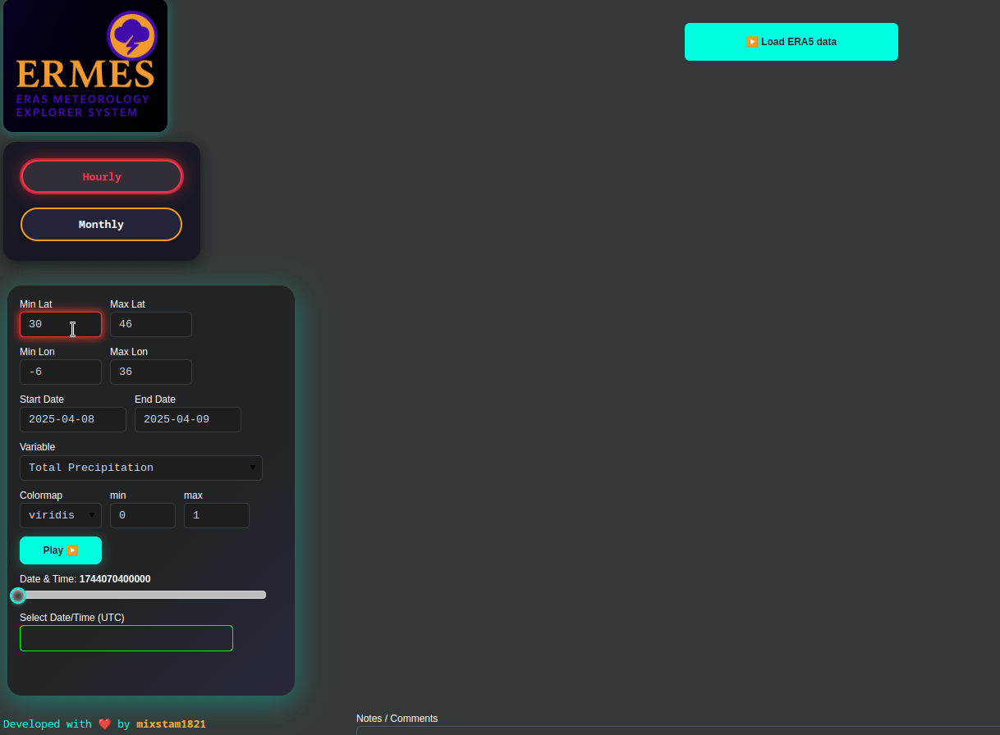
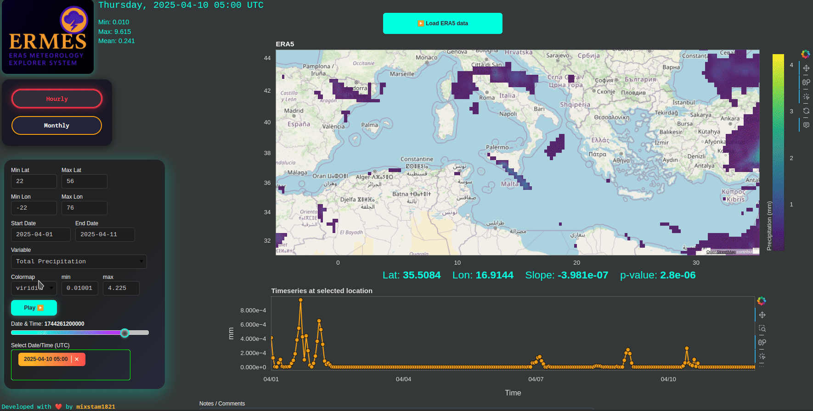
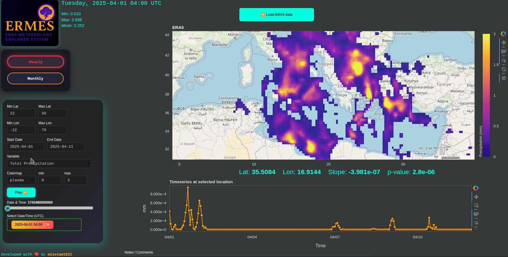
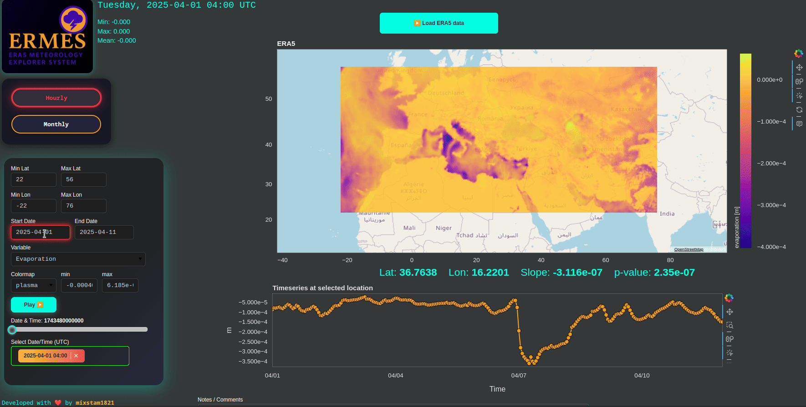
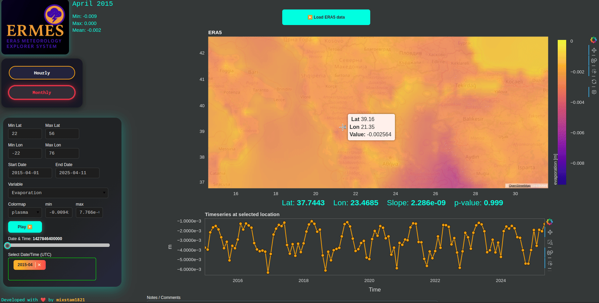

# ERMES
ERA5 METEOROLOGY EXPLORER SYSTEM

**Advanced interactive explorer for ERA5 reanalysis data, built in Python with Bokeh.**

Load, visualize and analyze atmospheric and oceanic variables with high precision for recent decades and historical weather events.

> **Note:** ERA5 data is updated with a delay. Please use data up to the last completed month—data for the current month may not yet be available.


---
## How to use it?

- Set the lat/lon range for the area of interest and select the date range (change the default values). Then press the button on the top to load the data. Live data is not supported currently. Please prefer to explore historical weather or climatic data.
  
  
- After around a minute, the data will be loaded from the ERA5 database. The map plot corresponds to one date, which you can change with the slider or the dropdown menu.
  Click on a specific point (lat/lon) to get the corresponding timeseries of the selected variable at the specific location. By clicking on the points in the timeseries, you can also change the date on the map.
  
  
- You can change the colormap and the it's min max values.
  
  
- Changing the variable will automatically start loading the new data.
  
  
- If you want to go monthly, firstly set the new date range (eg, April 2020 to May 2025) and then press the monthly button.
  
  
- After the monthly data loading, you can explore it or change the variable.
  


## 🌍 What is This?

This project lets you **fetch, plot, and analyze ERA5 climate data** for any Mediterranean subdomain, using a fast, responsive web interface (Bokeh server).  
**Features:**
- Hourly and Monthly ERA5 data fetch via Copernicus CDS
- Custom region and date range selection
- Beautiful, interactive map with colormap, slider, and real-time stats
- Click anywhere to get a timeseries at that location
- Fully styled, modern dark UI (custom CSS)
- Supports precipitation, temperature, winds, and more
- One-click data reload, animation (play/pause), and info overlays

---

## 🏁 Quick Start

1. **Install requirements:**
    ```bash
    pip install -r requirements.txt
    ```

2. **Set your Copernicus CDS API key**  
   Edit `ERMES.py` or your `.cdsapirc` file with your own [CDS API credentials](https://cds.climate.copernicus.eu/). Currently, my key is used.

3. **Run the app:**
    ```bash
    bokeh serve --show ERMES.py
    ```
OR

```
git clone https://github.com/mixstam1821/ERMES.git
cd ERMES
docker build -t ermes-app .
docker run -p 9263:9263 ermes-app
```
You will see a message: `Bokeh app running at: http://localhost:9263/ERMES`. Open `http://localhost:9263/ERMES` and enjoy.

OR

Visit the online [app](https://py.cafe/app/mixstam1821/ERMES%3A%20ERA5%20Meteorology%20Explorer%20System).

---

## ⚙️ Features & How To Use

- **Select Region:** Enter min/max latitude and longitude for your area.
- **Select Dates:** Use date pickers for start/end.
- **Variable:** Choose from 15+ ERA5 variables (wind, temp, precip, etc).
- **Colormap:** Try Viridis, Inferno, Plasma, Cividis, or Magma.
- **Slider:** Scroll through time; click "Play" for animation.
- **Map:** Tap any location to get a timeseries chart instantly.
- **Color scaling:** Adjust min/max for advanced contrast.
- **Custom Notes:** Add your own notes or comments in-app.

---

## 📦 Requirements

- Python 3.8+
- [Bokeh](https://bokeh.org/)
- `numpy`, `pandas`, `xarray`, `cdsapi`, `scipy`, `pyproj`
- See `requirements.txt` for all dependencies.

---

## 🛰️ Data Source

- **ERA5 Reanalysis** from [Copernicus Climate Data Store (CDS)](https://cds.climate.copernicus.eu/cdsapp#!/dataset/reanalysis-era5-single-levels)
- Supported for both **hourly** and **monthly** single-level fields.

---

## 🖼️ UI & Visualization

- **Map:** OpenStreetMap tiles, Web Mercator projection
- **Image:** High-res heatmap, auto-resampled for region
- **Stats:** Min/Max/Mean, real-time for the selected field
- **Interactive:** Responsive sliders, dropdowns, radio buttons, play/pause, multi-choice date select
- **CSS:** Sleek, modern dark theme with custom styling for all widgets

---

## 🛠️ Code Structure

```txt
ERMES.py
│
├── Imports, Theme, Variable Mappings
├── Widget/Style Definitions (lots of custom CSS)
├── ERA5 Fetcher (`fetch_era5`)
├── Projection and Interpolation Logic
├── Bokeh Plot Setups (Map, Timeseries, Controls)
├── Callbacks (Slider, Tap, Variable Change, etc)
└── App Layout & Main Loop
 ```
## Feedback
Feedback is welcome!
Please share your suggestions or issues to help me make this project even better.
